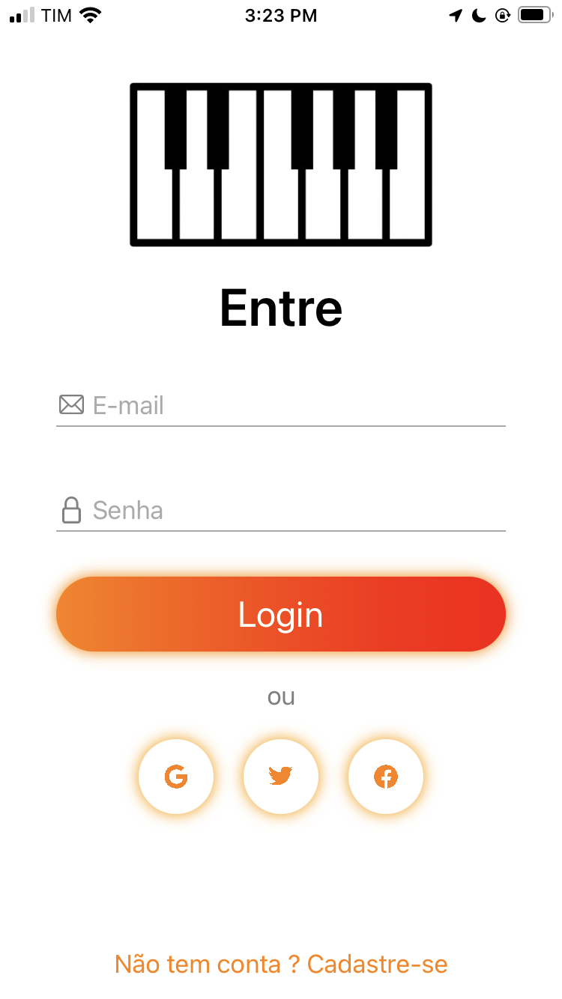
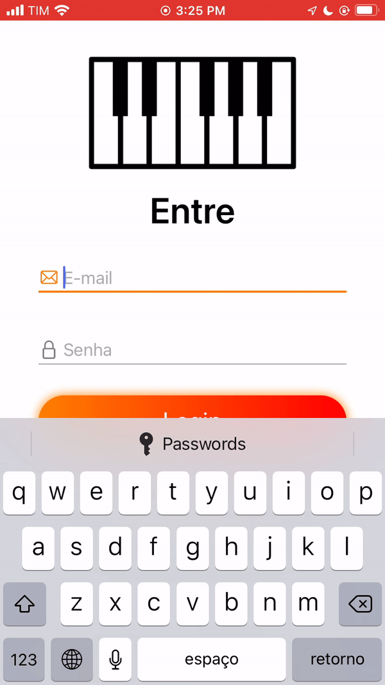

<h1 align="center">
  Programmatically-UI
</h1>   

 This is a repository that i made for store my learning of how to do UI Programmatically
  
  

  <a href="#Images">Images</a> •
  <a href="#Links">Links</a> •
  <a href="#autor">Autor</a> 

  
  </h1>

### Images 

<h1 align="center">
  
  

### Links 

There's not any course or solid material for learning how to make UI programmatically, so i gonna share some links that are helping me.
  
Storyboards Vs Programmatically: https://blog.logrocket.com/storyboard-vs-programmatically-ios-ui-design/
  
Introducing Auto Layout: https://www.youtube.com/watch?v=9RydRg0ZKaI
  
Auto Layout Constrains Programmatically: https://www.youtube.com/watch?v=HuCx6dGaY1g

UIKit Catalog Apple: https://developer.apple.com/documentation/uikit/mac_catalyst/uikit_catalog_creating_and_customizing_views_and_controls

Programming Constraints: https://dev.to/andrewlawlerdev/programmatic-constraints-in-swift-kj

  Lazy Var or Let to make UI ?: https://stackoverflow.com/questions/47367454/swift-lazy-var-vs-let-when-creating-views-programmatically-saving-memory#:~:text=Another%20advantage%20to%20using%20a,%2C%20setup%20function%2C%20or%20viewDidLoad%20.
  
---
### Autor 

| [ @HenriqueMarques](https://github.com/RickyMarq) |
| :---: |

 
  
 
  
